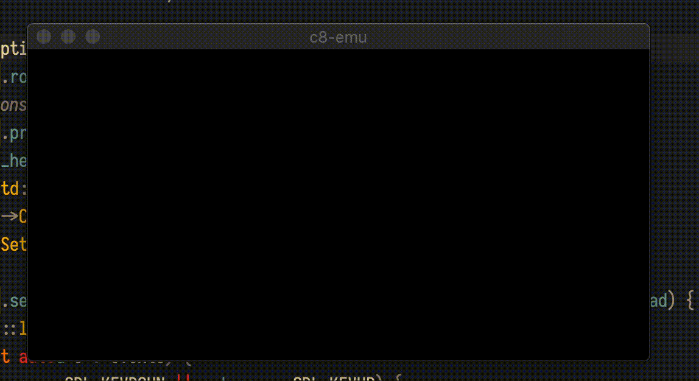

## A modern, multithreaded chip-8 emulator written in portable C++11.

**[Check out my blog series documenting the creation of this emulator!](https://river.codes/emulating-a-computer-part-1/)**

#### macOS/Linux builds
0. brew install sdl2 sdl2_image sdl2_mixer sdl2_net sdl2_ttf
1. Makefile: set SDL2CFLAGS to output of sdl2-config --cflags
2. Makefile: set LDFLAGS to output of sdl2-config --libs
3. make chip8
4. ./chip8

#### Windows builds (Visual C++)
Follow [these instructions](https://lazyfoo.net/tutorials/SDL/01_hello_SDL/windows/msvc2019/index.php). **Note**: Alter the SDL2 include folder structure to place all headers in a dir called `SDL2`. This is to match the distribution of SDL2 for non-Windows systems.
